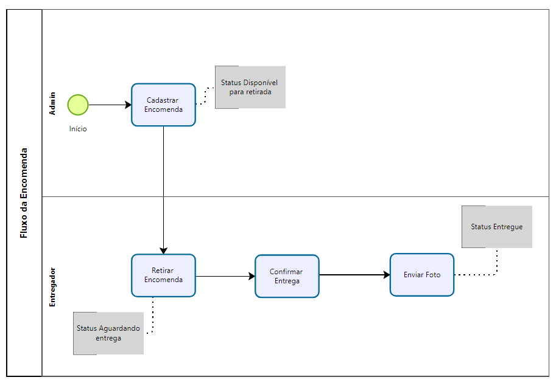

# 🚚 FastFeet

Sistema de gerenciamento de entregas desenvolvido como desafio da formação de Node da Rocketseat. O projeto inclui funcionalidades para controle de entregadores, destinatários, encomendas, envio de e-mail e upload de foto, autenticação(JWT) de usuário e autorização(RBAC).

## 📌 Sobre o Projeto

O **FastFeet** é uma aplicação voltada para gestão de encomendas onde:

- Um usuário cadastra destinatários e encomendas.
- Um entregador retira uma encomenda.
- Um entregador entrega a encomenda apenas realizando upload de uma foto comprovando a entrega.
- Sistema envia um e-mail a cada troca de status da encomenda.
- Possui testes automatizados.

Este projeto foi desenvolvido com foco em boas práticas de API RESTful, usando conceitos de DDD, Domain Events, Clean Architecture, contém autenticação JWT, envio de e-mails com Nodemailer e banco de dados relacional com mysql.

## 🚀 Tecnologias

- Node.js
- Typescript
- NestJS
- Prisma
- Zod
- Vitest
- MYSQL
- Multer
- JWT
- NodeMailer
- Docker

### Regras da aplicação

- [X] A aplicação deve ter dois tipos de usuário, entregador e/ou admin
- [X] Deve ser possível realizar login com CPF e Senha
- [X] Deve ser possível realizar o CRUD dos entregadores
- [X] Deve ser possível realizar o CRUD das encomendas
- [X] Deve ser possível realizar o CRUD dos destinatários
- [X] Deve ser possível marcar uma encomenda como aguardando (Disponível para retirada)
- [X] Deve ser possível retirar uma encomenda
- [X] Deve ser possível marcar uma encomenda como entregue
- [X] Deve ser possível listar as encomendas com endereços de entrega próximo ao local do entregador
- [X] Deve ser possível alterar a senha de um usuário
- [X] Deve ser possível listar as entregas de um usuário
- [X] Deve ser possível notificar o destinatário a cada alteração no status da encomenda

### Regras de negócio

- [X] Somente usuário do tipo admin pode realizar operações de CRUD nas encomendas
- [X] Somente usuário do tipo admin pode realizar operações de CRUD dos entregadores
- [X] Somente usuário do tipo admin pode realizar operações de CRUD dos destinatários
- [X] Para marcar uma encomenda como entregue é obrigatório o envio de uma foto
- [X] Somente o entregador que retirou a encomenda pode marcar ela como entregue
- [X] Somente o admin pode alterar a senha de um usuário
- [X] Não deve ser possível um entregador listar as encomendas de outro entregador

## Fluxograma - Fluxo da Encomenda

## Diagrama de Classe

